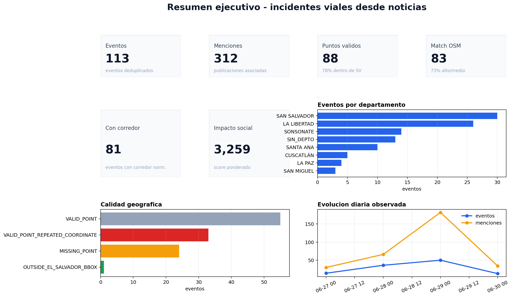
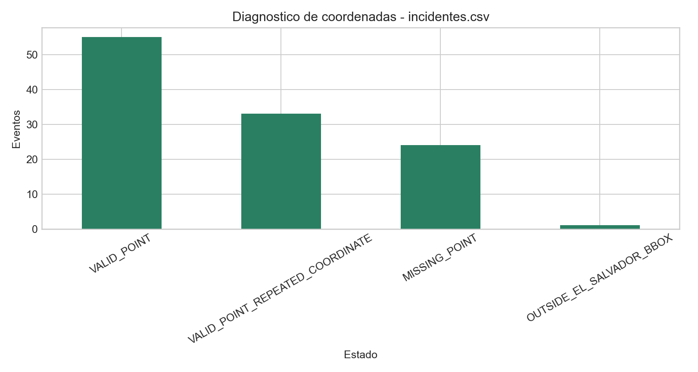
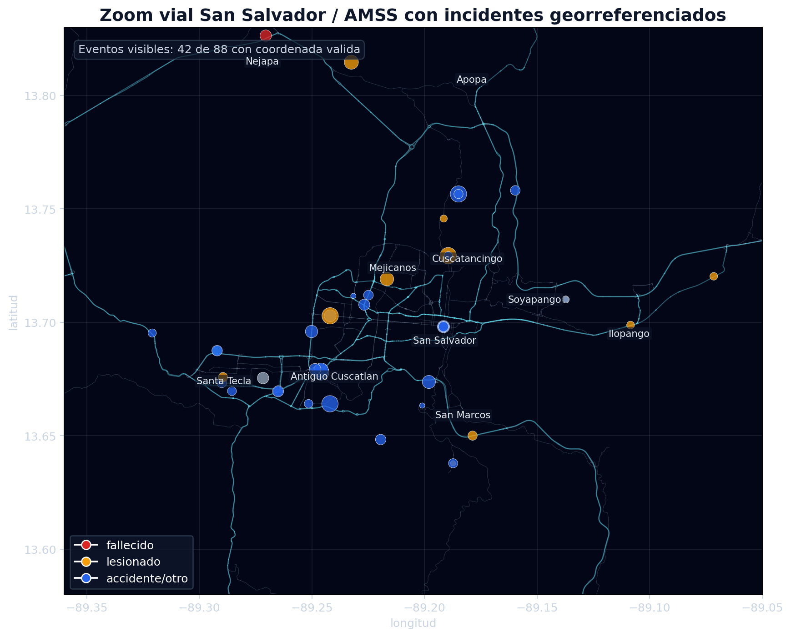
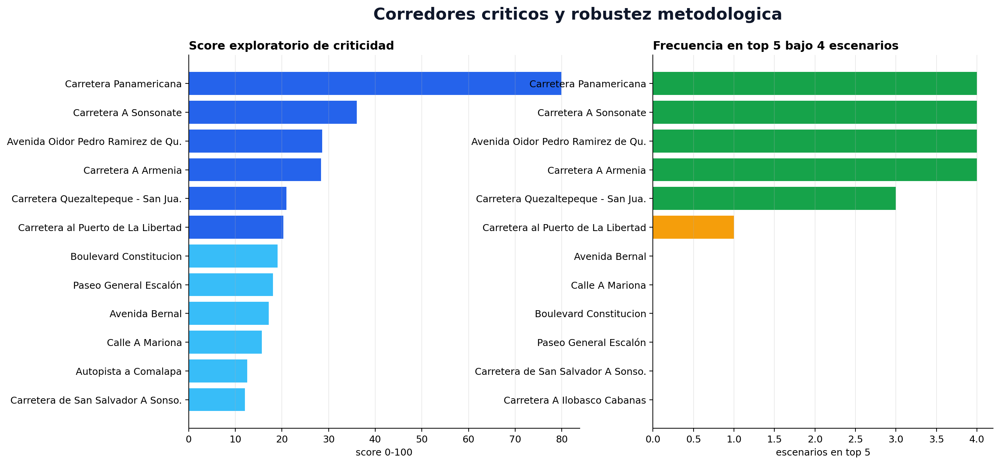
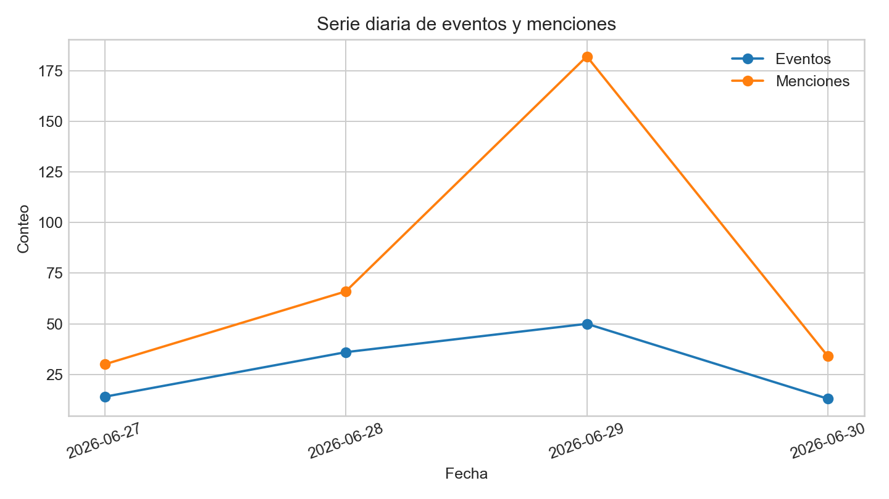
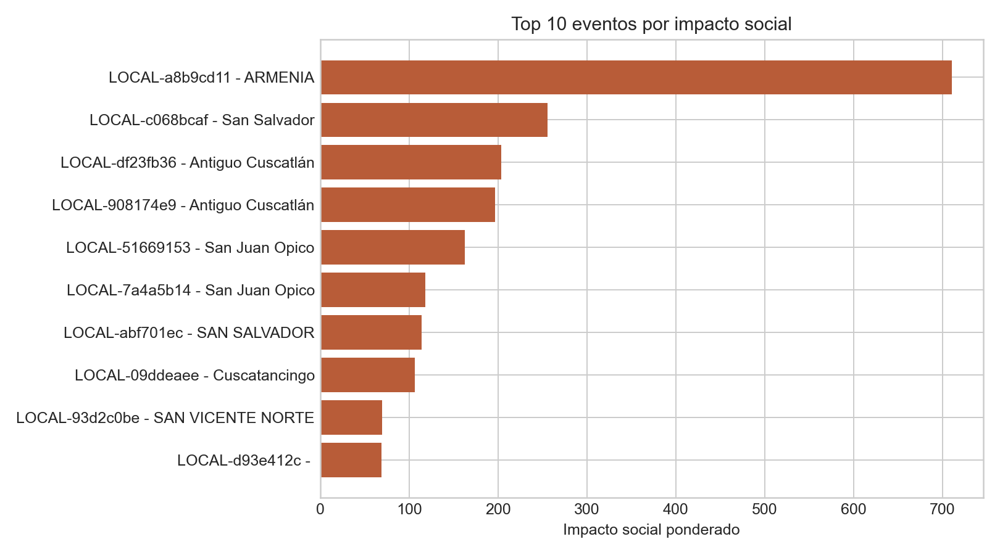

# Informe detallado - Analisis de incidentes.csv

**Fecha de generacion:** 2026-06-30T17:22:30

## 1. Proposito del analisis

Este informe documenta el trabajo realizado sobre `Data/News/incidentes.csv`. El objetivo no fue construir todavia el KPI final de movilidad, sino evaluar si los incidentes recopilados desde noticias y redes sociales pueden aportar una metrica complementaria util para el sistema de movilidad.

La pregunta de fondo es: **la informacion noticiosa georreferenciada permite detectar presion vial, recurrencia por corredor, severidad preliminar y amplificacion social de manera suficientemente estructurada para entrar al sistema de metricas?**

La respuesta, con los datos actuales, es positiva para una prueba de concepto: la base contiene eventos deduplicados, menciones, engagement, coordenadas, informacion territorial y posibilidad de asociacion con red vial OSM. La advertencia metodologica es que esta fuente no debe interpretarse como siniestralidad oficial.

## 2. Alcance y unidad de analisis

Se trabajaron tres unidades separadas:

- **Evento:** registro deduplicado de un incidente vial. Es la unidad principal.
- **Mencion:** publicacion, nota, tweet, RSS o entrada asociada al evento. Un evento puede tener multiples menciones.
- **Snapshot de engagement:** captura temporal de interacciones sociales asociadas a una mencion.

Esta separacion evita confundir cantidad de noticias con cantidad de eventos. Tambien permite medir amplificacion social sin duplicar incidentes.

### Resumen cuantitativo

- Eventos deduplicados: **113**.
- Menciones asociadas: **312**.
- Snapshots de engagement: **2,197**.
- Periodo observado: **2026-06-27 18:23:51** a **2026-06-30 12:07:28**.
- Eventos con coordenada dentro de El Salvador: **88** (77.88%).
- Eventos con asociacion OSM alta/media: **83** (73.45%).
- Eventos con corredor normalizado: **81** (71.68%).
- Corredores funcionales distintos: **46**.

## 3. Flujo implementado

El flujo implementado se estructura asi:

1. Lectura de `incidentes.csv`.
2. Normalizacion de campos temporales, territoriales, coordenadas y engagement.
3. Expansion de menciones y snapshots.
4. Diagnostico de integridad y calidad geografica.
5. Extraccion de severidad preliminar, usuarios vulnerables y contexto vial textual.
6. Descarga y construccion de red OSM departamental/nacional.
7. Asociacion espacial evento-via usando coordenada como fuente principal.
8. Resolucion semantica texto-OSM mediante `corridor_norm`.
9. Calculo de rankings territoriales, temporales, por tipo de via y por corredor.
10. Calculo de score exploratorio de corredores criticos.
11. Experimentos de pesos A/B/C y sensibilidad metodologica.
12. Generacion de dashboard y figuras ejecutivas.

## 4. Calidad e integridad del dato

El diagnostico de integridad muestra que la base tiene estructura suficiente para analisis exploratorio avanzado. Hay campos utiles de evento, fuente, ubicacion, evidencia, engagement, coordenadas y reglas de deduplicacion.

### Indicadores de integridad

| metric | value | percent | reading |
| --- | --- | --- | --- |
| eventos_totales | 113.0 | 100.0 | Unidad principal: evento vial deduplicado. |
| menciones_expandidas | 312.0 |  | Unidad secundaria: publicaciones asociadas al evento. |
| snapshots_engagement | 2197.0 |  | Capturas temporales de interaccion social. |
| eventos_con_lat_lon | 89.0 | 78.76 | Eventos con coordenada cruda en columnas principales. |
| eventos_con_lat_lon_dentro_sv_bbox | 88.0 | 77.88 | Puntos dentro del control preliminar de El Salvador. |
| eventos_fuera_sv_bbox | 1.0 | 0.88 | Posibles errores de geocodificacion. |
| eventos_sin_lat_lon | 24.0 | 21.24 | Eventos que requieren geocodificacion si se desea punto. |
| eventos_con_coordenada_repetida | 33.0 | 29.2 | No se eliminan; se analizan como recurrencia o posible punto generico. |
| eventos_con_address | 95.0 | 84.07 | Direccion textual disponible. |
| eventos_con_municipio | 98.0 | 86.73 | Municipio estructurado disponible. |
| eventos_con_departamento | 100.0 | 88.5 | Departamento estructurado disponible. |
| eventos_con_contexto_vial_textual | 72.0 | 63.72 | Texto permite extraer via, corredor, km o interseccion. |
| eventos_con_engagement | 98.0 | 86.73 | Eventos con likes, shares, views u otra interaccion. |
| eventos_con_multiples_menciones | 54.0 | 47.79 | Senal de amplificacion y/o corroboracion. |
| eventos_con_mas_de_una_fuente | 28.0 | 24.78 | Corroboracion multifuente. |
| eventos_con_osm_alto_medio | 83.0 | 73.45 | Puntos asociados con red OSM departamental, nacional o fallback AMSS a distancia razonable. |
| likes_ultimo_snapshot | 2185.0 |  | Likes acumulados usando el ultimo snapshot por mencion. |
| comments_ultimo_snapshot | 62.0 |  | Comentarios acumulados usando el ultimo snapshot por mencion. |
| shares_ultimo_snapshot | 170.0 |  | Compartidos/retweets acumulados usando el ultimo snapshot por mencion. |
| quotes_ultimo_snapshot | 2.0 |  | Citas acumuladas usando el ultimo snapshot por mencion. |
| views_ultimo_snapshot | 91246.0 |  | Visualizaciones acumuladas usando el ultimo snapshot por mencion. |
| impacto_social_ponderado_total | 3258.5411 |  | Suma del impacto social ponderado para heatmap principal. |
| impacto_raw_total | 93665.0 |  | Suma cruda de likes, comentarios, shares, quotes y views. |

### Calidad geografica

- Eventos con par latitud/longitud: **89**.
- Eventos dentro del bbox de El Salvador: **88**.
- Eventos sin coordenada: **24**.
- Eventos fuera del bbox de El Salvador: **1**.
- Eventos con coordenada repetida: **33**.

| coordinate_quality_status | events | mentions | impact_social | avg_geo_confidence | percent |
| --- | --- | --- | --- | --- | --- |
| VALID_POINT | 55 | 130 | 1988.5807 | 0.8154545454545454 | 48.67 |
| VALID_POINT_REPEATED_COORDINATE | 33 | 116 | 1022.5679 | 0.8227272727272726 | 29.2 |
| MISSING_POINT | 24 | 39 | 247.3925 | 0.4479166666666667 | 21.24 |
| OUTSIDE_EL_SALVADOR_BBOX | 1 | 27 | 0.0 | 0.9 | 0.88 |

La interpretacion es favorable: la mayoria de eventos cuenta con coordenadas utiles. Sin embargo, las coordenadas repetidas no se eliminan porque pueden significar recurrencia real, ubicacion generica o geocodificacion aproximada. Se conservan como una senal de calidad y se etiquetan para analisis.

## 5. Normalizacion territorial

Se conservaron los campos originales de departamento y municipio, pero se generaron campos normalizados para evitar fragmentacion por diferencias de escritura. Esto permite rankings consistentes por departamento y municipio.

### Ranking por departamento

| department_norm | events | traffic_accidents | mentions | impact_social | severity_sum | valid_points | avg_metric_score |
| --- | --- | --- | --- | --- | --- | --- | --- |
| SAN SALVADOR | 30 | 26 | 63 | 804.7124 | 12.43 | 27 | 49.595666666666666 |
| LA LIBERTAD | 26 | 25 | 105 | 939.5723 | 12.49 | 21 | 52.34653846153846 |
| SONSONATE | 14 | 14 | 52 | 853.337 | 9.54 | 13 | 55.67428571428571 |
| SIN_DEPTO | 13 | 12 | 19 | 162.5311 | 5.8100000000000005 | 2 | 33.05538461538462 |
| SANTA ANA | 10 | 10 | 21 | 191.9742 | 5.87 | 10 | 55.501 |
| CUSCATLÁN | 5 | 2 | 8 | 57.602 | 2.04 | 4 | 46.492 |
| LA PAZ | 4 | 4 | 13 | 57.7337 | 2.22 | 3 | 49.43 |
| SAN MIGUEL | 3 | 2 | 6 | 23.1567 | 0.87 | 1 | 35.72 |
| MORAZÁN | 2 | 2 | 3 | 39.9451 | 0.81 | 2 | 54.504999999999995 |
| USULUTÁN | 2 | 2 | 7 | 34.7138 | 1.05 | 1 | 50.825 |
| CABAÑAS | 2 | 2 | 3 | 17.2971 | 1.44 | 2 | 53.295 |
| SAN VICENTE | 1 | 1 | 8 | 69.5958 | 0.37 | 1 | 64.39 |
| CHALATENANGO | 1 | 1 | 4 | 6.3699 | 0.37 | 1 | 60.02 |

Los departamentos con mayor volumen son San Salvador, La Libertad, Sonsonate y Santa Ana. Esto sugiere concentracion en zonas urbanas y corredores interurbanos de alta exposicion noticiosa.

### Ranking por municipio

| department_norm | municipality_norm | events | mentions | impact_social | severity_sum | valid_points | avg_metric_score |
| --- | --- | --- | --- | --- | --- | --- | --- |
| SAN SALVADOR | San Salvador | 15 | 31 | 547.419 | 6.18 | 14 | 51.477999999999994 |
| SIN_DEPTO | SIN_MUNICIPIO | 12 | 18 | 142.7002 | 5.49 | 2 | 32.884166666666665 |
| SONSONATE | Sonsonate | 9 | 42 | 66.4413 | 5.75 | 9 | 54.58111111111111 |
| LA LIBERTAD | Santa Tecla | 9 | 26 | 63.5825 | 3.48 | 7 | 45.43666666666667 |
| SANTA ANA | Santa Ana | 7 | 12 | 63.7419 | 3.89 | 7 | 52.521428571428565 |
| LA LIBERTAD | Antiguo Cuscatlán | 5 | 17 | 480.9786 | 1.81 | 5 | 60.852 |
| CUSCATLÁN | San Rafael Cedros | 3 | 3 | 21.9026 | 1.42 | 2 | 42.17333333333334 |
| SONSONATE | Armenia | 2 | 5 | 713.3499 | 2.0 | 2 | 73.19 |
| LA LIBERTAD | San Juan Opico | 2 | 7 | 281.2633 | 1.32 | 2 | 70.17 |
| SAN SALVADOR | Cuscatancingo | 2 | 10 | 112.3539 | 0.79 | 2 | 57.36 |
| LA PAZ | La Paz Centro | 2 | 10 | 48.7337 | 1.26 | 2 | 58.26 |
| LA LIBERTAD | Quezaltepeque | 2 | 10 | 47.9363 | 1.95 | 1 | 63.43 |
| LA LIBERTAD | Colón | 2 | 7 | 23.093400000000003 | 0.98 | 1 | 44.66 |
| LA LIBERTAD | La Libertad Sur | 2 | 7 | 22.3319 | 0.64 | 2 | 52.48 |
| CABAÑAS | Ilobasco | 2 | 3 | 17.2971 | 1.44 | 2 | 53.295 |

La lectura municipal muestra concentracion en San Salvador, Sonsonate, Santa Tecla, Santa Ana y Antiguo Cuscatlan. A nivel de movilidad, el municipio ayuda a priorizar territorio, pero la lectura por corredor resulta mas accionable.

## 6. Severidad preliminar y variables extraidas

A partir del texto y campos estructurados se construyeron variables de severidad preliminar. Estas variables no sustituyen partes oficiales, pero permiten diferenciar eventos de bajo contenido informativo frente a incidentes con lesionados, fallecidos o usuarios vulnerables.

### Distribucion de severidad

| events | count |
| --- | --- |
| TRAFFIC_ACCIDENT_UNSPECIFIED | 56 |
| INJURY_REPORTED | 29 |
| FATALITY_REPORTED | 15 |
| OTHER_LOW_INFORMATION | 8 |
| MATERIAL_DAMAGE_ONLY | 3 |
| ROAD_AFFECTATION | 2 |

- Eventos con fallecidos: **15**.
- Eventos con lesionados: **33**.
- Eventos con usuarios vulnerables: **29**.
- Eventos con vehiculos pesados: **31**.

Estas variables son relevantes porque una metrica de movilidad no deberia ponderar igual un reporte de congestion, un accidente con lesionados y un evento con fallecidos.

## 7. Red OSM departamental y nacional

Se construyo una red OSM enriquecida por departamentos usando Overpass API. La logica fue particionar la red para evitar cargar todo el pais en cada operacion interactiva. El consolidado nacional queda como producto analitico y respaldo.

### Cobertura OSM generada

| department | slug | status | query_mode | segments | catalog_roads | length_km |
| --- | --- | --- | --- | --- | --- | --- |
| AHUACHAPAN | ahuachapan | OK | AREA | 5296 | 4484 | 2367.094 |
| CABAÑAS | cabanas | OK | AREA | 2168 | 1764 | 1235.662 |
| CHALATENANGO | chalatenango | OK | AREA | 3974 | 3271 | 2303.235 |
| CUSCATLÁN | cuscatlan | OK | BBOX | 9110 | 7280 | 3261.646 |
| LA LIBERTAD | la_libertad | OK | AREA | 16308 | 12756 | 4127.487 |
| LA PAZ | la_paz | OK | AREA | 5195 | 4408 | 2118.056 |
| LA UNION | la_union | OK | AREA | 4808 | 4132 | 2782.474 |
| MORAZÁN | morazan | OK | AREA | 3055 | 2567 | 1991.577 |
| SAN MIGUEL | san_miguel | OK | AREA | 9101 | 7303 | 3820.706 |
| SAN SALVADOR | san_salvador | OK | AREA | 22899 | 16261 | 4105.946 |
| SAN VICENTE | san_vicente | OK | AREA | 2385 | 1903 | 1158.036 |
| SANTA ANA | santa_ana | OK | AREA | 11588 | 8944 | 3858.915 |
| SONSONATE | sonsonate | OK | AREA | 8142 | 6570 | 2750.714 |
| USULUTÁN | usulutan | OK | AREA | 5192 | 4319 | 2438.85 |

El resultado permite que el match evento-via funcione fuera del AMSS. La prioridad de busqueda implementada es:

1. Si el evento tiene coordenada y departamento normalizado, se usa la red OSM de ese departamento.
2. Si no hay red departamental o falla, se usa la red nacional consolidada.
3. Si aplica y existe, AMSS queda como respaldo local.
4. Si no hay coordenada, no se fuerza match espacial y el evento queda como `NO_COORDINATE_FOR_OSM`.

## 8. Asociacion evento-via con OSM

La asociacion evento-via se hizo con la coordenada como fuente principal. Esto es metodologicamente importante porque el texto de una noticia puede mencionar una carretera general, una interseccion, una colonia o una referencia local. La coordenada permite buscar el segmento vial mas cercano en OSM y medir distancia.

La clasificacion espacial usada fue:

- `SPATIAL_OSM_HIGH`: distancia menor o igual a 50 m.
- `SPATIAL_OSM_MEDIUM`: distancia mayor a 50 m y menor o igual a 150 m.
- `SPATIAL_OSM_LOW_REVIEW`: distancia mayor a 150 m y menor o igual a 500 m.
- `SPATIAL_OSM_DISTANCE_CONFLICT`: distancia mayor a 500 m.
- `NO_COORDINATE_FOR_OSM`: evento sin coordenada.
- `INVALID_POINT_FOR_OSM`: coordenada invalida para asociacion.

### Resultado del match OSM

| events | count |
| --- | --- |
| SPATIAL_OSM_HIGH | 77 |
| NO_COORDINATE_FOR_OSM | 24 |
| SPATIAL_OSM_MEDIUM | 6 |
| SPATIAL_OSM_DISTANCE_CONFLICT | 2 |
| SPATIAL_OSM_LOW_REVIEW | 2 |
| NO_NEAR_OSM_SEGMENT | 1 |
| INVALID_POINT_FOR_OSM | 1 |

### Fuente OSM usada

| events | count |
| --- | --- |
| DEPARTMENT | 100 |
| NATIONAL | 13 |

El resultado principal es que **83 eventos** tienen asociacion OSM alta o media. Esto demuestra que la capa de noticias puede conectarse operativamente con la red vial, no solo con unidades administrativas.

### Tipo de via OSM asociado

| nearest_osm_road_type | events | mentions | impact_social | avg_distance_m |
| --- | --- | --- | --- | --- |
|  | 26 | 72 | 265.6984 |  |
| LOCAL_RESIDENCIAL | 23 | 71 | 1113.4552 | 21.04 |
| ARTERIAL_PRINCIPAL | 19 | 72 | 478.2348 | 6.2368421052631575 |
| SERVICIO_ACCESO | 13 | 22 | 335.2482 | 17.10846153846154 |
| ARTERIAL_SECUNDARIA | 9 | 26 | 510.4382 | 5.144444444444445 |
| COLECTORA | 9 | 23 | 324.44640000000004 | 139.36777777777775 |
| NACIONAL_ESTRUCTURANTE | 7 | 16 | 127.7895 | 80.3442857142857 |
| NO_CLASIFICADA_OSM | 7 | 10 | 103.2304 | 92.02857142857144 |

La presencia de tipos como `LOCAL_RESIDENCIAL`, `ARTERIAL_PRINCIPAL`, `ARTERIAL_SECUNDARIA`, `COLECTORA` y `NACIONAL_ESTRUCTURANTE` permite comenzar a diferenciar la naturaleza vial de los incidentes.

## 9. Resolucion texto-OSM y corridor_norm

OSM puede dividir una misma via en muchos segmentos y nombrarlos con etiquetas locales. Por ejemplo, una noticia puede decir `Carretera Panamericana`, mientras OSM devuelve un segmento local como `2a Calle Poniente` con referencia `CA-1`. Para evitar fragmentacion, se creo `corridor_norm`, que representa el corredor funcional consolidado.

Columnas creadas:

- `corridor_norm`: corredor funcional consolidado.
- `corridor_norm_source`: fuente usada para resolverlo: `OSM_REF`, `OSM_NAME`, `TEXT_ALIAS`, `MANUAL_RULE` o `UNRESOLVED`.
- `text_corridor_norm`: corredor inferido desde el texto de la noticia.
- `nearest_osm_corridor_norm`: corredor inferido desde OSM.
- `text_osm_resolution`: clasificacion de compatibilidad texto-OSM.
- `corridor_resolution_confidence`: confianza de la resolucion.

### Fuentes de corridor_norm

| events | count |
| --- | --- |
| TEXT_ALIAS | 44 |
| UNRESOLVED | 32 |
| OSM_NAME | 17 |
| MANUAL_RULE | 11 |
| OSM_REF | 9 |

### Resolucion texto-OSM

| events | count |
| --- | --- |
| UNRESOLVED | 57 |
| COMPATIBLE | 25 |
| INTERSECTION_ACCEPTED | 12 |
| REVIEW_COORDINATE_OR_NAME | 10 |
| LOCAL_NAME_WITHIN_CORRIDOR | 9 |

Los conflictos no se eliminaron. Se reclasificaron como compatibles, intersecciones aceptadas, nombre local dentro de corredor, revision o no resuelto. Esto mantiene trazabilidad metodologica.

Casos en revision/conflicto documentados: **41**.

| ticketNumber | department_norm | municipality_norm | corridor_candidate | nearest_osm_name | nearest_osm_ref | corridor_norm | text_osm_resolution | corridor_resolution_confidence | nearest_osm_distance_m |
| --- | --- | --- | --- | --- | --- | --- | --- | --- | --- |
| LOCAL-c2d38977 | SANTA ANA | Ciudad Arce | carretera de santa ana a san salvador | Carretera Panamericana | CA-1W | Carretera Panamericana | REVIEW_COORDINATE_OR_NAME | MEDIUM | 504.5 |
| LOCAL-51669153 | LA LIBERTAD | San Juan Opico | calle de tacachico a san juan opico | 2a Calle Oriente | LIB 25 | Carretera Quezaltepeque - San Juan Opico | COMPATIBLE | HIGH | 5.68 |
| LOCAL-3278eb4b | USULUTÁN | Santiago de María | carretera de santiago de maria | 1a Avenida Norte |  | Carretera de Santiago de Maria | INTERSECTION_ACCEPTED | MEDIUM | 26.36 |
| LOCAL-96137d66 | SONSONATE | Sonsonate | carretera a ilobasco cabanas manana de este lunes | Avenida Oidor Pedro Ramírez de Quiñónez | CA-8W | Carretera A Ilobasco Cabanas Manana de Este Lunes | REVIEW_COORDINATE_OR_NAME | LOW | 2.26 |
| LOCAL-a8b9cd11 | SONSONATE | Armenia | carretera a armenia | 1a Calle Oriente |  | Carretera A Armenia | INTERSECTION_ACCEPTED | MEDIUM | 14.56 |
| LOCAL-7c1094ad | SANTA ANA | Candelaria de la Frontera | carretera a candelaria de la frontera | 3a Calle Oriente |  | Carretera A Candelaria de la Frontera | REVIEW_COORDINATE_OR_NAME | LOW | 19.92 |
| LOCAL-207c6ded | SONSONATE | Sonsonate | carretera a sonsonate | Avenida Oidor Pedro Ramírez de Quiñónez | CA-8W | Carretera A Sonsonate | INTERSECTION_ACCEPTED | MEDIUM | 2.26 |
| LOCAL-2adca74e | CUSCATLÁN | Cuscatlán Norte | carretera a san jose guayabal san martin un | 1a Calle Oriente |  | Carretera A San Jose Guayabal San Martin Un | REVIEW_COORDINATE_OR_NAME | LOW | 7.99 |
| LOCAL-5e8a1137 | SAN SALVADOR | San Salvador | paseo general escalon | 89 Avenida Sur |  | Paseo General Escalón | INTERSECTION_ACCEPTED | MEDIUM | 2.02 |
| LOCAL-e0ae06ca | SONSONATE | Los Naranjos | carretera de santa ana a sonsonate tramo de los naranjos | Calle a Cantón Los Naranjos | SON100N | Carretera de Santa Ana A Sonsonate Tramo de los Naranjos | INTERSECTION_ACCEPTED | MEDIUM | 6.2 |
| LOCAL-c068bcaf | SAN SALVADOR | San Salvador | paseo general escalon | 89 Avenida Sur |  | Paseo General Escalón | INTERSECTION_ACCEPTED | MEDIUM | 2.02 |
| LOCAL-7a4a5b14 | LA LIBERTAD | San Juan Opico | carretera de quezaltepeque a san juan opico | 2a Calle Oriente | LIB 25 | Carretera Quezaltepeque - San Juan Opico | COMPATIBLE | HIGH | 5.68 |
| LOCAL-aeee7e6e | SANTA ANA | Santa Ana | carretera panamericana |  |  | Carretera Panamericana | UNRESOLVED | LOW | 3.13 |
| LOCAL-21c774c0 | LA LIBERTAD | Santa Tecla | tramo los chorros | Carretera Panamericana | CA-1W | Carretera Panamericana | COMPATIBLE | HIGH | 36.25 |
| LOCAL-ab4de5e6 | LA LIBERTAD | Santa Tecla | carretera panamericana | 2a Calle Poniente | CA-1 | Carretera Panamericana | COMPATIBLE | HIGH | 0.36 |

## 10. Corredores normalizados y criticidad

El resultado mas accionable del analisis es el ranking por corredor normalizado. Este nivel es mas util para movilidad que solo mirar puntos o municipios, porque permite priorizar tramos, carreteras y ejes viales.

### Ranking por corredor normalizado

| corridor_norm | events | mentions | impact_social | severity_sum | valid_points | fatality_events | injury_events | vulnerable_events | osm_high_medium | compatible_events | review_events |
| --- | --- | --- | --- | --- | --- | --- | --- | --- | --- | --- | --- |
| Carretera Panamericana | 18 | 46 | 442.7074 | 6.84 | 14 | 0 | 4 | 1 | 13 | 7 | 2 |
| Carretera al Puerto de La Libertad | 5 | 21 | 43.8862 | 1.64 | 5 | 0 | 0 | 0 | 5 | 5 | 0 |
| Carretera A Sonsonate | 4 | 10 | 39.4794 | 3.65 | 4 | 3 | 1 | 3 | 3 | 2 | 0 |
| Autopista a Comalapa | 3 | 6 | 45.517399999999995 | 1.23 | 2 | 0 | 1 | 0 | 2 | 1 | 0 |
| Boulevard Constitucion | 3 | 29 | 25.5425 | 1.25 | 2 | 0 | 1 | 0 | 2 | 2 | 0 |
| Avenida Oidor Pedro Ramirez de Quinonez | 3 | 29 | 14.0 | 2.37 | 3 | 1 | 2 | 1 | 3 | 3 | 0 |
| Carretera Quezaltepeque - San Juan Opico | 2 | 7 | 281.2633 | 1.32 | 2 | 1 | 0 | 1 | 2 | 2 | 0 |
| Paseo General Escalón | 2 | 11 | 278.9268 | 0.98 | 2 | 0 | 1 | 0 | 2 | 2 | 0 |
| Calle A Mariona | 2 | 4 | 117.5171 | 1.22 | 2 | 0 | 1 | 2 | 2 | 2 | 0 |
| Avenida Bernal | 2 | 8 | 71.0778 | 1.27 | 1 | 0 | 2 | 2 | 1 | 1 | 0 |
| Carretera Troncal del Norte | 2 | 5 | 6.3699 | 0.92 | 2 | 0 | 1 | 0 | 2 | 2 | 0 |
| Carretera A Armenia | 1 | 4 | 710.3499 | 1.0 | 1 | 1 | 0 | 1 | 1 | 1 | 0 |
| Carretera de San Salvador A Sonsonate Altura de Piedras Pachas | 1 | 4 | 67.9789 | 0.96 | 1 | 1 | 1 | 0 | 1 | 1 | 0 |
| Carretera de Santa Ana A Sonsonate Tramo de los Naranjos | 1 | 3 | 67.5458 | 0.48 | 1 | 0 | 0 | 1 | 1 | 1 | 0 |
| Carretera Antigua A Nejapa | 1 | 3 | 55.6094 | 0.76 | 1 | 0 | 1 | 0 | 1 | 0 | 1 |

La `Carretera Panamericana` aparece como el corredor dominante: concentra volumen, menciones, asociaciones OSM y recurrencia territorial. Otros corredores relevantes son `Carretera A Sonsonate`, `Carretera al Puerto de La Libertad`, `Autopista a Comalapa`, `Boulevard Constitucion` y `Paseo General Escalon`.

### Score exploratorio de corredores criticos

Se calculo un score exploratorio que combina volumen, menciones, impacto social, severidad, fallecidos, lesionados, usuarios vulnerables y asociacion OSM alta/media. Este score no es el KPI final; sirve para priorizar corredores que merecen analisis detallado.

| corridor_norm | events | mentions | impact_social | severity_sum | fatality_events | injury_events | vulnerable_events | osm_high_medium | avg_osm_distance_m | corridor_criticality_score |
| --- | --- | --- | --- | --- | --- | --- | --- | --- | --- | --- |
| Carretera Panamericana | 18 | 46 | 442.7074 | 6.84 | 0 | 4 | 1 | 13 | 59.410714285714285 | 79.88 |
| Carretera A Sonsonate | 4 | 10 | 39.4794 | 3.65 | 3 | 1 | 3 | 3 | 7.19 | 36.05 |
| Avenida Oidor Pedro Ramirez de Quinonez | 3 | 29 | 14.0 | 2.37 | 1 | 2 | 1 | 3 | 2.26 | 28.61 |
| Carretera A Armenia | 1 | 4 | 710.3499 | 1.0 | 1 | 0 | 1 | 1 | 14.56 | 28.35 |
| Carretera Quezaltepeque - San Juan Opico | 2 | 7 | 281.2633 | 1.32 | 1 | 0 | 1 | 2 | 5.68 | 20.94 |
| Carretera al Puerto de La Libertad | 5 | 21 | 43.8862 | 1.64 | 0 | 0 | 0 | 5 | 7.052000000000001 | 20.31 |
| Boulevard Constitucion | 3 | 29 | 25.5425 | 1.25 | 0 | 1 | 0 | 2 | 2.45 | 19.07 |
| Paseo General Escalón | 2 | 11 | 278.9268 | 0.98 | 0 | 1 | 0 | 2 | 2.02 | 18.05 |
| Avenida Bernal | 2 | 8 | 71.0778 | 1.27 | 0 | 2 | 2 | 1 | 1.56 | 17.17 |
| Calle A Mariona | 2 | 4 | 117.5171 | 1.22 | 0 | 1 | 2 | 2 | 6.28 | 15.72 |
| Autopista a Comalapa | 3 | 6 | 45.517399999999995 | 1.23 | 0 | 1 | 0 | 2 | 11.555 | 12.53 |
| Carretera de San Salvador A Sonsonate Altura de Piedras Pachas | 1 | 4 | 67.9789 | 0.96 | 1 | 1 | 0 | 1 | 0.58 | 12.06 |
| Carretera A Ilobasco Cabanas | 1 | 1 | 2.0 | 1.0 | 1 | 1 | 1 | 1 | 1.78 | 11.24 |
| Carretera Antigua A Zacatecoluca | 1 | 7 | 48.7337 | 0.71 | 0 | 1 | 1 | 1 | 3.63 | 10.24 |
| 1a Avenida Sur | 1 | 2 | 18.0 | 1.0 | 1 | 0 | 1 | 1 | 31.87 | 10.2 |

## 11. Experimentos de pesos y sensibilidad

Se implementaron experimentos para evaluar si los corredores criticos dependen de un solo supuesto de ponderacion.

Escenarios:

- **Actual:** balance exploratorio entre volumen, severidad, engagement y match OSM.
- **A - Recurrencia/volumen:** mayor peso a cantidad de eventos.
- **B - Severidad:** mayor peso a severidad, fallecidos, lesionados y usuarios vulnerables.
- **C - Social/noticioso:** mayor peso a menciones e impacto social.

No se buscaron pesos optimos porque no existe una verdad externa observada contra la cual calibrar. La finalidad fue evaluar robustez.

### Corredores robustos

| corridor | rank_ACTUAL_PIPELINE | rank_A_RECURRENCIA_VOLUMEN | rank_B_SEVERIDAD | rank_C_SOCIAL_NOTICIOSO | ranking_promedio | score_promedio_normalizado | frecuencia_top_5 | clasificacion_robustez |
| --- | --- | --- | --- | --- | --- | --- | --- | --- |
| Carretera Panamericana | 1 | 1 | 1 | 1 | 1.0 | 78.84 | 4 | ROBUSTO |
| Carretera A Sonsonate | 2 | 2 | 2 | 4 | 2.5 | 37.63 | 4 | ROBUSTO |
| Avenida Oidor Pedro Ramirez de Quinonez | 3 | 3 | 3 | 3 | 3.0 | 28.93 | 4 | ROBUSTO |
| Carretera A Armenia | 4 | 5 | 4 | 2 | 3.75 | 27.83 | 4 | ROBUSTO |
| Carretera Quezaltepeque - San Juan Opico | 5 | 7 | 5 | 5 | 5.5 | 20.94 | 3 | ROBUSTO |

Los corredores robustos son importantes porque se mantienen en posiciones altas aunque cambie el enfoque metodologico. La `Carretera Panamericana` es el caso mas claro: aparece en primer lugar en todos los escenarios.

## 12. Temporalidad

El periodo cubierto es corto, por lo que no permite afirmar tendencia estructural. Aun asi, la serie diaria permite observar picos de actividad noticiosa y de engagement.

| event_date | events | traffic_accidents | mentions | impact_social | views | shares | valid_points | avg_metric_score |
| --- | --- | --- | --- | --- | --- | --- | --- | --- |
| 2026-06-27 | 14 | 11 | 30 | 23.1391 | 3425.0 | 0.0 | 6 | 34.075 |
| 2026-06-28 | 36 | 32 | 66 | 410.6244 | 13149.0 | 21.0 | 33 | 49.44916666666667 |
| 2026-06-29 | 50 | 49 | 182 | 2414.1288 | 62034.0 | 130.0 | 45 | 55.1228 |
| 2026-06-30 | 13 | 11 | 34 | 410.6488 | 12638.0 | 19.0 | 4 | 44.51461538461539 |

La mayor actividad aparece el 29 de junio de 2026, con mayor volumen de eventos, menciones, visualizaciones y shares. Esto muestra que la fuente puede usarse para monitoreo temprano, siempre que se amplie la ventana temporal.

### Serie horaria

| event_hour | events | mentions | impact_social | views | shares | avg_metric_score |
| --- | --- | --- | --- | --- | --- | --- |
| 0.0 | 2.0 | 2.0 | 6.0981 | 444.0 | 0.0 | 42.7 |
| 1.0 | 1.0 | 1.0 | 10.0 | 0.0 | 0.0 | 29.28 |
| 2.0 | 2.0 | 2.0 | 10.0 | 0.0 | 0.0 | 53.035 |
| 5.0 | 2.0 | 6.0 | 22.2151 | 1926.0 | 1.0 | 41.1 |
| 6.0 | 11.0 | 22.0 | 295.417 | 4777.0 | 8.0 | 49.907272727272726 |
| 7.0 | 4.0 | 8.0 | 43.1708 | 1538.0 | 1.0 | 49.38 |
| 8.0 | 11.0 | 32.0 | 174.6625 | 12209.0 | 16.0 | 49.811818181818175 |
| 9.0 | 8.0 | 18.0 | 124.5083 | 3237.0 | 16.0 | 49.685 |
| 10.0 | 8.0 | 23.0 | 205.6538 | 9117.0 | 13.0 | 49.32375 |
| 11.0 | 7.0 | 26.0 | 384.4738 | 10870.0 | 22.0 | 54.86714285714286 |
| 12.0 | 3.0 | 3.0 | 14.4451 | 1058.0 | 0.0 | 42.73333333333333 |
| 13.0 | 1.0 | 3.0 | 67.5458 | 5144.0 | 4.0 | 62.36 |
| 14.0 | 3.0 | 9.0 | 56.651700000000005 | 3055.0 | 7.0 | 54.81 |
| 15.0 | 4.0 | 8.0 | 145.7015 | 5373.0 | 18.0 | 57.9625 |
| 16.0 | 5.0 | 14.0 | 133.4633 | 8018.0 | 13.0 | 56.220000000000006 |
| 17.0 | 4.0 | 33.0 | 736.2354 | 2532.0 | 21.0 | 56.4125 |
| 18.0 | 9.0 | 26.0 | 139.524 | 5259.0 | 5.0 | 47.22777777777778 |
| 19.0 | 6.0 | 15.0 | 117.0998 | 6757.0 | 11.0 | 49.86333333333334 |
| 20.0 | 5.0 | 31.0 | 287.91970000000003 | 2506.0 | 11.0 | 47.096 |
| 21.0 | 9.0 | 10.0 | 195.5377 | 655.0 | 1.0 | 43.01 |
| 22.0 | 7.0 | 19.0 | 85.2177 | 6771.0 | 2.0 | 45.962857142857146 |
| 23.0 | 1.0 | 1.0 | 3.0 | 0.0 | 0.0 | 56.4 |

## 13. Engagement e impacto social

El engagement permite medir amplificacion social y visibilidad publica. No mide accidentalidad real, pero si ayuda a identificar donde un evento genero mayor conversacion o exposicion digital.

- Likes ultimo snapshot: **2,185**.
- Comentarios ultimo snapshot: **62**.
- Shares/retweets ultimo snapshot: **170**.
- Views ultimo snapshot: **91,246**.
- Impacto social ponderado total: **3,258.54**.

### Engagement por fuente

| source | menciones | eventos | latest_likes | latest_comments | latest_shares | latest_quotes | latest_views |
| --- | --- | --- | --- | --- | --- | --- | --- |
| X | 174 | 73 | 465.0 | 18.0 | 126.0 | 2.0 | 90836.0 |
| RSS | 64 | 11 | 0.0 | 0.0 | 0.0 | 0.0 | 0.0 |
| FACEBOOK | 46 | 40 | 866.0 | 38.0 | 44.0 | 0.0 | 0.0 |
| INSTAGRAM | 21 | 21 | 854.0 | 6.0 | 0.0 | 0.0 | 410.0 |
| GOOGLE_NEWS | 7 | 5 | 0.0 | 0.0 | 0.0 | 0.0 | 0.0 |

La fuente con mayor cantidad de menciones es `X`, seguida por RSS, Facebook e Instagram. Esto sugiere que las fuentes sociales y noticiosas no aportan el mismo tipo de senal: X concentra volumen y visualizaciones; Facebook e Instagram aportan interacciones distintas.

## 14. Figuras generadas

Se generaron figuras tecnicas y ejecutivas:

- `fig_resumen_ejecutivo_incidentes.png`: indicadores principales, territorio, calidad geografica y evolucion diaria.
- `fig_corredores_sensibilidad_incidentes.png`: corredores criticos y robustez por escenarios.
- `fig_mapa_ejecutivo_incidentes.png`: incidentes georreferenciados sobre red vial principal OSM.
- `diagnostico_coordenadas_incidentes.png`: calidad geografica.
- `ranking_impacto_social_incidentes.png`: eventos con mayor impacto social.
- `serie_diaria_eventos_incidentes.png`: serie diaria.
- `serie_horaria_eventos_incidentes.png`: serie horaria.

## 15. Productos generados

Archivos principales en `Results/News/Incidentes`:

- `eventos_incidentes_osm_nacional_enriched.csv`: base final enriquecida evento-via.
- `base_menciones_incidentes_expandida.csv`: menciones asociadas a eventos.
- `base_engagement_snapshots.csv`: snapshots de engagement.
- `ranking_departamentos_incidentes.csv`: ranking territorial departamental.
- `ranking_municipios_incidentes.csv`: ranking territorial municipal.
- `ranking_corredores_norm.csv`: ranking por corredor funcional normalizado.
- `analisis_corredores_criticos.csv`: score exploratorio de corredores.
- `corridor_norm_resolution.csv`: trazabilidad de resolucion texto-OSM.
- `revision_conflictos_texto_osm_nacional.csv`: casos a revisar.
- `diagnostico_cobertura_osm_departamental.csv`: cobertura OSM por departamento.
- `ranking_tipo_via_osm_nacional.csv`: tipo de via OSM asociado.
- `experimentos_pesos_corredores.csv`: scores bajo escenarios de pesos.
- `sensibilidad_pesos_corredores.csv`: robustez de corredores.
- `experimentos_pesos_corredores.txt`: explicacion de sensibilidad.
- `resultados_incidentes.txt`: resumen completo de resultados tabulados.

## 16. Limitaciones

Las principales limitaciones son:

- El periodo observado es corto: cuatro dias. No permite concluir tendencias de largo plazo.
- Las noticias tienen sesgo de cobertura: no todos los incidentes se reportan y no todos los territorios tienen igual visibilidad.
- El engagement mide amplificacion social, no gravedad vial real.
- Hay eventos sin coordenada y eventos con coordenadas repetidas.
- Algunas asociaciones texto-OSM requieren revision porque OSM puede nombrar segmentos con nombres locales o porque la noticia menciona un corredor amplio.
- No hay calibracion contra fuentes oficiales de siniestralidad, aforos o tiempos de viaje.

## 17. Conclusiones

El analisis demuestra que `incidentes.csv` tiene valor para el sistema de metricas de movilidad como fuente complementaria. La base permite construir una metrica exploratoria de presion socio-vial que combina evento, territorio, via, severidad preliminar y amplificacion social.

La evidencia mas fuerte es la asociacion evento-via: 83 eventos tienen match OSM alto o medio, y se obtuvieron 46 corredores normalizados. Esto permite pasar de una lectura noticiosa a una lectura operacional por corredor.

La `Carretera Panamericana` aparece como el corredor mas consistente y critico. Tambien destacan `Carretera A Sonsonate`, `Avenida Oidor Pedro Ramirez de Quinonez`, `Carretera A Armenia` y `Carretera Quezaltepeque - San Juan Opico` como corredores robustos bajo experimentos de sensibilidad.

La recomendacion es incorporar esta fuente como **metrica complementaria exploratoria**, no como KPI final. Su rol seria detectar presion vial noticiosa, priorizar corredores para revision, observar amplificacion social y alimentar capas de monitoreo geoespacial.

## 18. Recomendaciones de continuidad

Para evolucionar esta prueba de concepto hacia una metrica madura se recomienda:

1. Ampliar la ventana temporal a varias semanas o meses.
2. Mantener la coordenada como fuente principal de asociacion evento-via.
3. Usar `corridor_norm` como unidad principal para analisis vial.
4. Separar siempre evento, mencion y engagement.
5. Incorporar exposicion vial por corredor: longitud, jerarquia vial, volumen vehicular si existe, TPDA o velocidades.
6. Cruzar posteriormente con fuentes oficiales para calibrar el valor explicativo de la metrica.
7. Mantener dashboard con capas: red vial base, puntos, heat eventos, heat menciones y heat impacto social.

## 19. Lectura ejecutiva final

Las noticias no reemplazan los datos oficiales, pero si aportan una senal temprana y espacialmente util. Con `incidentes.csv` ya es posible identificar corredores recurrentes, eventos severos, zonas con alta amplificacion social y calidad de asociacion con red vial. Por tanto, la fuente merece entrar al sistema de metricas como una capa complementaria de monitoreo socio-vial.
